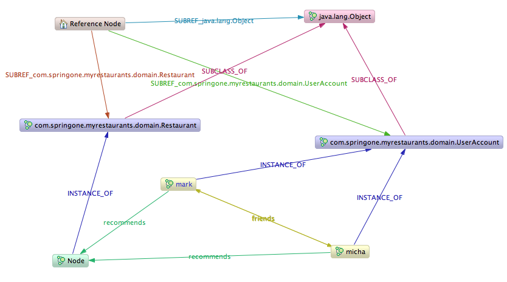
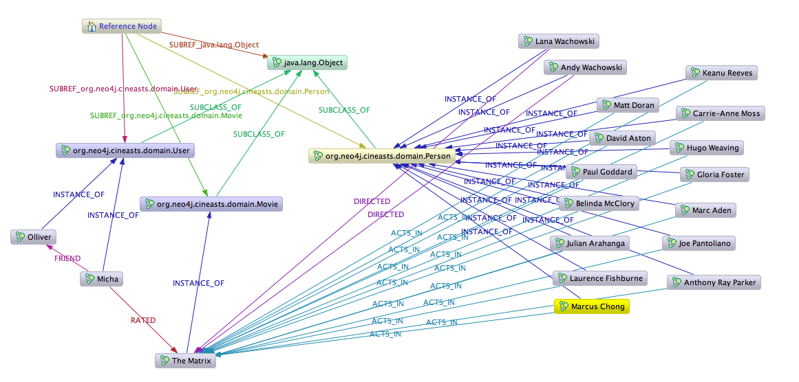
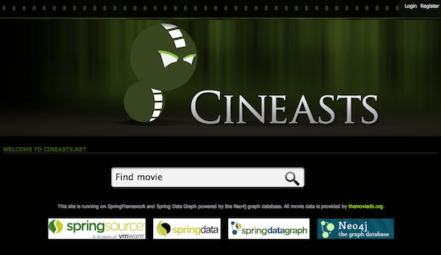

[[reference_samples]]
= Sample code

[[samples_introduction]]
== Introduction

Spring Data Neo4j comes with a number of sample applications. The source code of the samples can be found on http://spring.neo4j.org/exampless[Github]. The different sample projects are introduced below.

[[samples_hello-worlds]]
== Hello Worlds sample application

The Hello Worlds sample application exists merely to provide a client with a way of creating some "worlds" (node entities) and "rocket routes" (relationships) between worlds, all in a galaxy (the graph). There is currently no GUI for this application, rather you can have a look at the associated unit tests for some examples of how to interact with this domain via a dedicated `GalaxyService` class.

The unit tests additionally demonstrate some other features of Spring Data Neo4j as well. The sample comes with a minimal configuration for Maven and Spring to get up and running quickly.

The Hello Worlds application is available both for the simple mapping (`hello-worlds`) and for the advanced mapping (`hello-world-aspects`).

Running the unit tests create two versions of the world, one based on the default Label based Type Representation Strategy, and another (for comparison purposes) based on the Sub Reference type representation strategy. From the `GalaxyService` clients perspective, there is no difference, however how the data physically stored in the graph, does differ, and we take this opportunity to show you how using two different type representation strategies can impact how your data is modelled in the graph itself.

Hello World Galaxy - Using default "Label" Type Representation Strategy 

image::helloworlds-labeltrs.png[]

Hello World Galaxy - Using "Sub Reference" Type Representation Strategy 

image::helloworlds-subreftrs.png[]

[[samples_imdb]]
== IMDB sample application

NOTE: This sample application still needs to be upgraded to SDN 3.0.X

 The IMDB sample is a web application that imports datasets from the Internet Movie Database (IMDB) into the graph database. It allows the listing of movies with their actors, and of actors and their roles in different movies. It also uses graph traversal operations to calculate the http://en.wikipedia.org/wiki/Bacon_number[Bacon number] of any given actor. This sample application shows the usage of Spring Data Neo4j in a more complex setting, using several annotated entities and relationships as well as indexes and in-graph indexes and graph traversals.

See the readme file for instructions on how to compile and run the application.

An excerpt of the data stored in the graph database after executing the application:

image::imdb.png[]

[[samples_myrestaurants-original]]
== MyRestaurants sample application

NOTE: This sample application still needs to be upgraded to SDN 3.0.X

Simple, JPA-based web application for managing users and restaurants, with the ability to add restaurants as favorites to a user. It is basically the foundation for the MyRestaurants-Social application (see<<samples:myrestaurants-social>>), and does therefore not use Spring Data Neo4j.

image::restaurant.png[]

[[samples_myrestaurants-social]]
== MyRestaurant-Social sample application

NOTE: This sample application still needs to be upgraded to SDN 3.0.X

This application extends the MyRestaurants sample application, adding social networking functionality to it with cross-store persistence. The web application allows for users to add friends and rate restaurants. A graph traversal provides recommendations based on your friends' (and their friends') rating of restaurants.

Here's an excerpt of the data stored in the graph database after executing the application:

image::restaurant-social.png[]

[[samples_cineasts]]
== Cineasts social movie database

NOTE: This sample application still needs to be upgraded to SDN 3.0.X

The cineasts.net application was introduced extensively in the first part of this guide, the tutorial. The tutorial covers the development of the simple mapping version of cineasts.

To document the differences, versions for the advanced mapping (`cineasts-aspects`) and accessing the remote server (`cineasts-rest`) are also available.

A online version of cineasts can be found on http://cineasts.net[cineasts.net]. A sample dataset of the cineasts database is available at the neo4j http://sample-data.neo4j.org[sample-data page].

This is a subset of the visualization of the cineasts graph for the "Matrix" movie.

