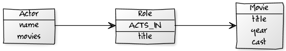

[[tutorial_relationships]]
= Relationships

*_A convincing act_*

Our application was not very much fun yet, just storing movies and actors. After all, the power is in the relationships between them. Fortunately, Neo4j treats relationships as first class citizens, allowing them to be addressed individually and have properties assigned to them. That allows for representing them as entities if needed.

== Creating relationships

Relationships without properties ("anonymous" relationships) don't require any `@RelationshipEntity` classes. "Unfortunately" we had none of those, because our relationships were richer. Therefore we went with the `Role` relationship between `Movie` and `Actor`. It had to be annotated with `@RelationshipEntity` and the `@StartNode` and `@EndNode` had to be marked. So our Role looked like this:

.Role class
====
[source,java]
----
@RelationshipEntity
class Role {
    @StartNode Actor actor;
    @EndNode Movie movie;
    String role;
}
----
====

When writing a test for the `Role` we tried to create the relationship entity just by instantiating it with `new` and saving it with the template, but we got an exception saying that it misses the relationship-type.

We had to add it to the `@RelationshipEntity` as an attribute (or as a `@RelationshipType` annotated field in the RelationshipEntity). Another way to create instances of relationship-entities is to use the methods provided by the template, like `createRelationshipBetween`.

.Relating actors to movies
====
[source,java]
----
@RelationshipEntity(type="ACTS_IN")
class Role {
    @StartNode Actor actor;
    @EndNode Movie movie;
    String role;
}
class Actor {
...
    public Role playedIn(Movie movie, String roleName) {
        Role role = new Role(this, movie, roleName);
        this.roles.add(role);
        return role;
    }
}

Role role = tomHanks.playedIn(forrestGump, "Forrest Gump");

// either save the actor
template.save(tomHanks);
// or the role
template.save(role);

// alternative approach
Role role = template.createRelationshipBetween(actor,movie,
                       Role.class, "ACTS_IN");
----
====

Saving just the actor would take care of relationships with the same type between two entities and remove the duplicates. Whereas just saving the role happily creates another relationship with the same type.

== Accessing related entities

Now we wanted to find connected entities. We already had fields for the relationships in both classes. It was time to annotate them correctly. The Neo4j relationship type and direction were easy to figure out. The direction even defaulted to outgoing, so we only had to specify it for the movie. If we want to use the same relationship between the two entities we have to make sure to provide a dedicated type, otherwise the field-names would be used resulting in different relationships.

.@RelatedTo usage
====
[source,java]
----
@NodeEntity
class Movie {
    @Indexed(unique=true) String id;
    String title;
    int year;
    @RelatedTo(type = "ACTS_IN", direction = Direction.INCOMING)
    Set<Actor> cast;
}

@NodeEntity
class Actor {
    @Indexed(unique=true) int id;
    String name;
    @RelatedTo(type = "ACTS_IN")
    Set<Movie> movies;

    public Role playedIn(Movie movie, String roleName) {
        return new Role(this,movie, roleName);
    }
}
----
====

Changes to the collections of related entities are reflected into the graph on saving of the entity.

We made sure to add some tests for using the relationships, so we were assured that the collections worked as advertised.

== Accessing the relationship entities

But we still couldn't access the Role relationship entities themselves. It turned out that there was a separate annotation `@RelatedToVia` for accessing the actual relationship entities. And we could declare the field as an `Iterable<Role>`, with read-only semantics or on a `Collection` or `Set<Role>` field with modifying semantics.  So off we went, creating our first real relationship (just kidding).

To have the collections of relationships being read eagerly during the loading of the Movie we have to annotate it with the `@Fetch` annotation. Otherwise Spring Data Neo4j refrains from following relationships automatically. The risk of loading the whole graph into memory would be too high.

.@RelatedToVia usage
====
[source,java]
----
@NodeEntity
class Movie {
    @Indexed(unique=true) String id;
    String title;
    int year;

    @Fetch @RelatedToVia(type = "ACTS_IN", direction = Direction.INCOMING)
    Iterable<Roles> roles;
}
----
====

After watching the tests pass, we were confident that the changes to the relationship fields were really stored to the underlying relationships in the graph. We were pretty satisfied with persisting our domain.
