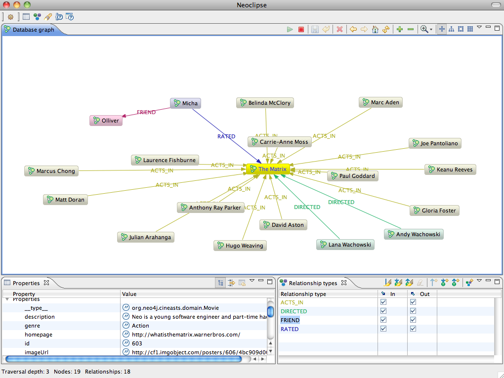

[[tutorial_running]]
= Get it running

*_Curtains up!_*

Now we had a pretty complete application. It was time to put it to the test.

== Populating the database

Before we opened the gates we needed to add some movie data. So we wrote a small class for populating the database which could be called from our controller. A simple `/populate` endpoint for the controller that called it would be enough for now.

.Populating the database - Controller
====
[source,java]
----
@Service
public class DatabasePopulator {

    @Transactional
    public List<Movie> populateDatabase() {
        Actor tomHanks = new Actor("1", "Tom Hanks");
        Movie forrestGump = new Movie("1", "Forrest Gump");
        tomHanks.playedIn(forrestGump,"Forrest");
        template.save(forrestGump);
        return asList(forrestGump);
    }
}

@Controller
public class MovieController {

    @Autowired private DatabasePopulator populator;

    @RequestMapping(value = "/populate", method = RequestMethod.POST)
    public String populateDatabase(Model model) {
        Collection<Movie> movies = populator.populateDatabase();
        model.addAttribute("movies",movies);
        return "/movies/list";
    }
}
----
====

Accessing the URI we could see the list of movies we had added.

== Inspecting the datastore

Being the geeks we are, we also wanted to inspect the raw data in the database. Reading the http://docs.neo4j.org/[Neo4j docs], there were a couple of different ways of going about this.

=== Neoclipse visualization

First we tried Neoclipse, an Eclipse RCP application that opens an existing graph store and visualizes its content. After getting an exception about concurrent access, we learned that we have to use Neoclipse in read-only mode when our webapp was still running. Good to know.

=== The Neo4j Shell

For console junkies there was also a shell that was able to connect to a running Neo4j instance (if it was started with the `enable_remote_shell=true` parameter), or reads an existing graph store directly.

.Starting the Neo4j Shell
====
[source]
----
bash# neo4j-shell -readonly -path data/graph.db
bash# neo4j-shell -readonly -port 1337
----
====

The shell was very similar to a standard Bash shell. We were able to `cd` to between the nodes, and `ls` the relationships and properties. There were also more advanced commands for indexing, queries and traversals.

.Neo4j Shell usage
====
[source]
----
neo4j-sh[readonly] (0)$ help
Available commands: index dbinfo ls rm alias set eval mv gsh env rmrel mkrel
                    trav help pwd paths ... man cd
Use man <command> for info about each command.

neo4j-sh[readonly] (0)$ index --cd -g User login micha

neo4j-sh[readonly] (Micha,1)$ ls
*__type__ =[org.neo4j.cineasts.domain.User]
*login    =[micha]
*name     =[Micha]
*roles    =[ROLE_ADMIN,ROLE_USER]
(me) --[FRIEND]-> (Olliver,2)
(me) --[RATED]-> (The Matrix,3)

neo4j-sh[readonly] (Micha,1)$ ls 2
*__type__ =[org.neo4j.cineasts.domain.User]
*login    =[ollie]
*name     =[Olliver]
*roles    =[ROLE_USER]
(Olliver,2) <-[FRIEND]-- (me)

neo4j-sh[readonly] (Micha,1)$ cd 3

neo4j-sh[readonly] (The Matrix,3)$ ls
*__type__     =[org.neo4j.cineasts.domain.Movie]
*description  =[Neo is a young software engineer and part-time hacker who is singled  ...]
*genre        =[Action]
*homepage     =[http://whatisthematrix.warnerbros.com/]
...
*studio       =[Warner Bros. Pictures]
*tagline      =[Welcome to the Real World.]
*title        =[The Matrix]
*trailer      =[http://www.youtube.com/watch?v=UM5yepZ21pI]
*version      =[324]
(me) <-[ACTS_IN]-- (Marc Aden,19)
(me) <-[ACTS_IN]-- (David Aston,18)
...
(me) <-[ACTS_IN]-- (Keanu Reeves,6)
(me) <-[DIRECTED]-- (Andy Wachowski,5)
(me) <-[DIRECTED]-- (Lana Wachowski,4)
(me) <-[RATED]-- (Micha,1)
----
====
