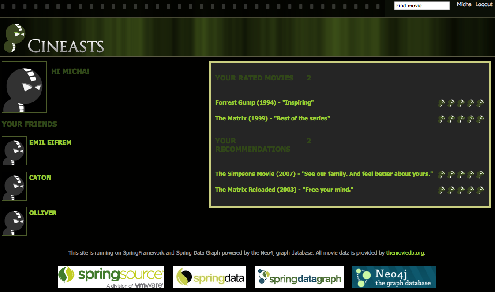

[[tutorial_security]]
= Adding Security

*_Protecting assets_*

To handle an active user in the webapp we had to put it in the session and add login and registration pages. Of course the pages that were only meant for logged-in users had to be secured as well.

Being Spring users, we naturally used Spring Security for this. We wrote a simple `UserDetailsService` by extending a repository with a custom implementation that takes care of looking up the users and validating their credentials. The config is located in a separate `applicationContext-security.xml`. But first, as always, Maven and `web.xml` setup.

.Spring Security pom.xml
====
[source,xml]
----
<dependency>
    <groupId>org.springframework.security</groupId>
    <artifactId>spring-security-web</artifactId>
    <version>${spring.version}</version>
</dependency>
<dependency>
    <groupId>org.springframework.security</groupId>
    <artifactId>spring-security-config</artifactId>
    <version>${spring.version}</version>
</dependency>
----
====

.Spring Security web.xml
====
[source,xml]
----
<context-param>
    <param-name>contextConfigLocation</param-name>
    <param-value>
        /WEB-INF/applicationContext-security.xml
        /WEB-INF/applicationContext.xml
    </param-value>
</context-param>

<listener>
    <listener-class>org.springframework.web.context.ContextLoaderListener</listener-class>
</listener>

<filter>
    <filter-name>springSecurityFilterChain</filter-name>
    <filter-class>org.springframework.web.filter.DelegatingFilterProxy</filter-class>
</filter>

<filter-mapping>
    <filter-name>springSecurityFilterChain</filter-name>
    <url-pattern>/*</url-pattern>
</filter-mapping>
----
====

.Spring Security applicationContext-security.xml
====
[source,xml]
----
<security:global-method-security secured-annotations="enabled">
</security:global-method-security>

<security:http auto-config="true" access-denied-page="/auth/denied">
    <security:intercept-url pattern="/admin/*" access="ROLE_ADMIN"/>
    <security:intercept-url pattern="/import/*" access="ROLE_ADMIN"/>
    <security:intercept-url pattern="/user/*" access="ROLE_USER"/>
    <security:intercept-url pattern="/auth/login" access="IS_AUTHENTICATED_ANONYMOUSLY"/>
    <security:intercept-url pattern="/auth/register" access="IS_AUTHENTICATED_ANONYMOUSLY"/>
    <security:intercept-url pattern="/**" access="IS_AUTHENTICATED_ANONYMOUSLY"/>
    <security:form-login login-page="/auth/login" 
	   authentication-failure-url="/auth/login?login_error=true"
    default-target-url="/user"/>
    <security:logout logout-url="/auth/logout" logout-success-url="/" invalidate-session="true"/>
</security:http>

<security:authentication-manager>
    <security:authentication-provider user-service-ref="userRepository">
        <security:password-encoder hash="md5">
            <security:salt-source system-wide="cewuiqwzie"/>
        </security:password-encoder>
    </security:authentication-provider>
</security:authentication-manager>
----
====

.CineastsUserDetailsService interface and UserRepository custom implementation
====
[source,java]
----

public interface CineastsUserDetailsService extends UserDetailsService {
    @Override
    CineastsUserDetails loadUserByUsername(String login)
                 throws UsernameNotFoundException, DataAccessException;

    User getUserFromSession();

    @Transactional
    Rating rate(Movie movie, User user, int stars, String comment);

    @Transactional
    User register(String login, String name, String password);

    @Transactional
    void addFriend(String login, final User userFromSession);
}

public interface UserRepository extends GraphRepository<User>,
        RelationshipOperationsRepository<User>,
        CineastsUserDetailsService {

    User findByLogin(String login);
}

public class UserRepositoryImpl implements CineastsUserDetailsService {

  @Autowired private Neo4jOperations template;

  @Override
  public CineastsUserDetails loadUserByUsername(String login)
         throws UsernameNotFoundException, DataAccessException {
      final User user = findByLogin(login);
      if (user==null) throw
         new UsernameNotFoundException("Username not found: "+login);
      return new CineastsUserDetails(user);
  }

  private User findByLogin(String login) {
      return template.lookup(User.class,"login",login)
                     .to(User.class).single();
  }

  @Override
  public User getUserFromSession() {
      SecurityContext context = SecurityContextHolder.getContext();
      Authentication authentication = context.getAuthentication();
      Object principal = authentication.getPrincipal();
      if (principal instanceof CineastsUserDetails) {
          CineastsUserDetails userDetails = (CineastsUserDetails) principal;
          return userDetails.getUser();
      }
      return null;
  }
}

public class CineastsUserDetails implements UserDetails {
    private final User user;

    public CineastsUserDetails(User user) {
        this.user = user;
    }

    @Override
    public Collection<GrantedAuthority> getAuthorities() {
        User.Roles[] roles = user.getRoles();
        if (roles ==null) return Collections.emptyList();
        return Arrays.<GrantedAuthority>asList(roles);
    }

    @Override
    public String getPassword() {
        return user.getPassword();
    }

    @Override
    public String getUsername() {
        return user.getLogin();
    }

    ...
    public User getUser() {
        return user;
    }
}
----
====

Any logged-in user was now available in the session, and could be used for all the social interactions. The remaining work for this was mainly adding controller methods and JSPs for the views. We used the helper method `getUserFromSession()` in the controllers to access the logged-in user and put it in the model for rendering. Here's what the UI had evolved to:

